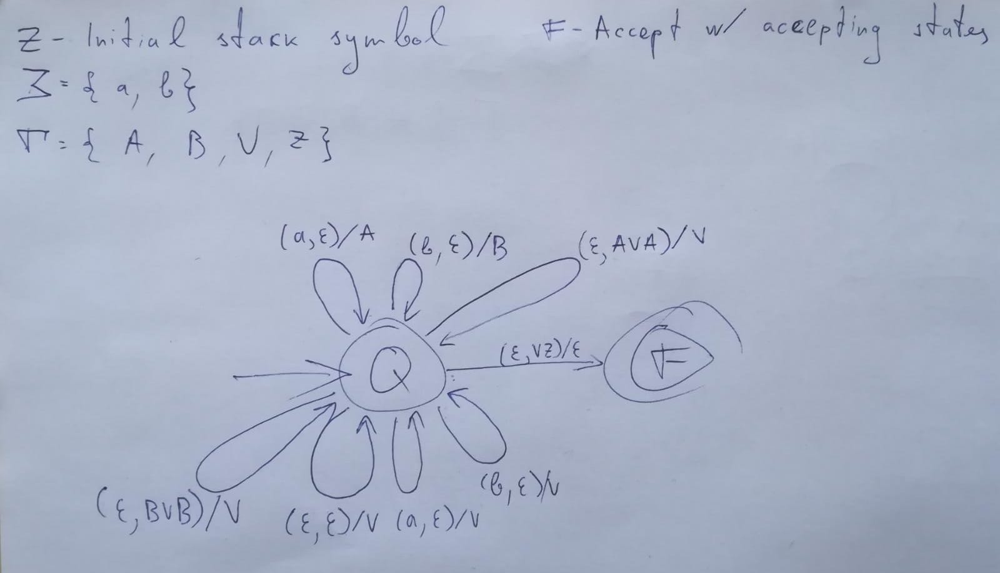

# Pushdown automaton aka magazine automata interpreter

Written for a formal grammar course in university.  
Unfortunately couldn't write modular code, because source code must be submitted as one whole file.  

## Usage
```
nvm use
npm install
npm run test
npm run compile
MAX_TICKS=8 npm run start test/integration/automata1.txt
```

The commands will run an automaton interpreter REPL for `automata1`, which was provided as an example automaton to test against.  

  

Example REPL usage
```
Insert word for interpreter: 
Read word: ''
Accepted word '' in 2 ticks
Accepted using the following transitions:
{ state: Q word: [  ], stack: [ Z ] }
{ state: Q word: [  ], stack: [ Z, V ] }
{ state: F word: [  ], stack: [  ] }

Insert word for interpreter: aa
Read word: 'aa'
Accepted word 'aa' in 5 ticks
Accepted using the following transitions:
{ state: Q word: [ a, a ], stack: [ Z ] }
{ state: Q word: [ a ], stack: [ Z, A ] }
{ state: Q word: [ a ], stack: [ Z, A, V ] }
{ state: Q word: [  ], stack: [ Z, A, V, A ] }
{ state: Q word: [  ], stack: [ Z, V ] }
{ state: F word: [  ], stack: [  ] }

Insert word for interpreter: aaaa
Read word: 'aaaa'
Accepted word 'aaaa' in 8 ticks
Accepted using the following transitions:
{ state: Q word: [ a, a, a, a ], stack: [ Z ] }
{ state: Q word: [ a, a, a ], stack: [ Z, A ] }
{ state: Q word: [ a, a ], stack: [ Z, A, A ] }
{ state: Q word: [ a, a ], stack: [ Z, A, A, V ] }
{ state: Q word: [ a ], stack: [ Z, A, A, V, A ] }
{ state: Q word: [ a ], stack: [ Z, A, V ] }
{ state: Q word: [  ], stack: [ Z, A, V, A ] }
{ state: Q word: [  ], stack: [ Z, V ] }
{ state: F word: [  ], stack: [  ] }

Insert word for interpreter: ba
Read word: 'ba'
Interpreter reached tick limit: Reached debug tick limit 8, couldn't accept word

Insert word for interpreter: 
```